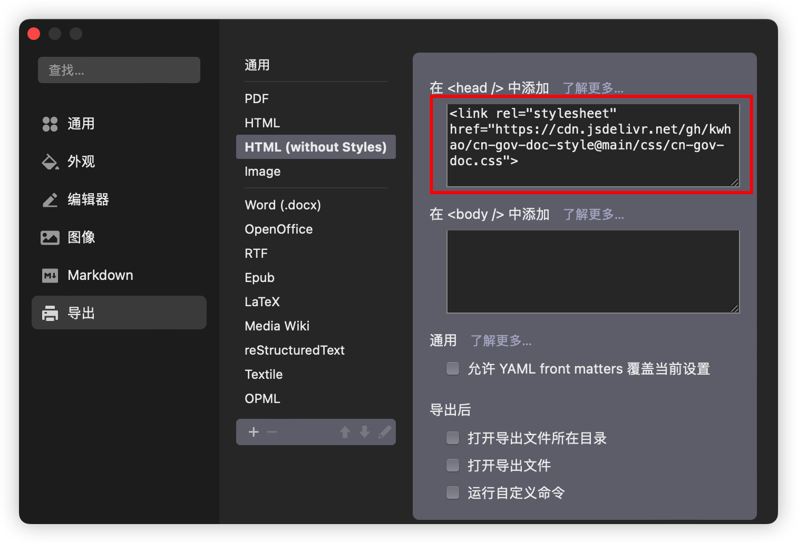
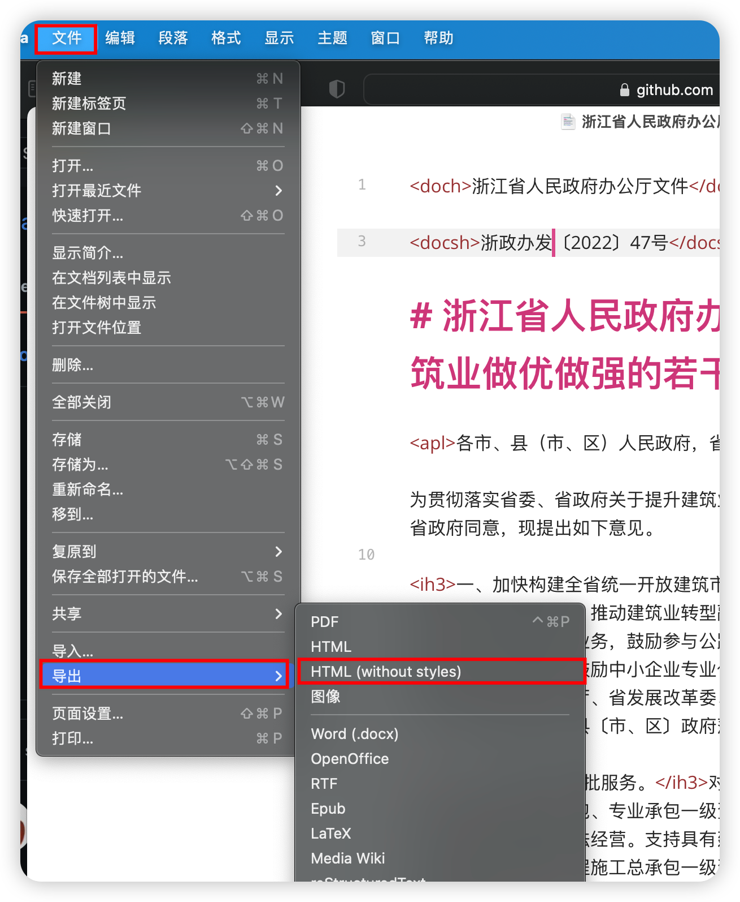
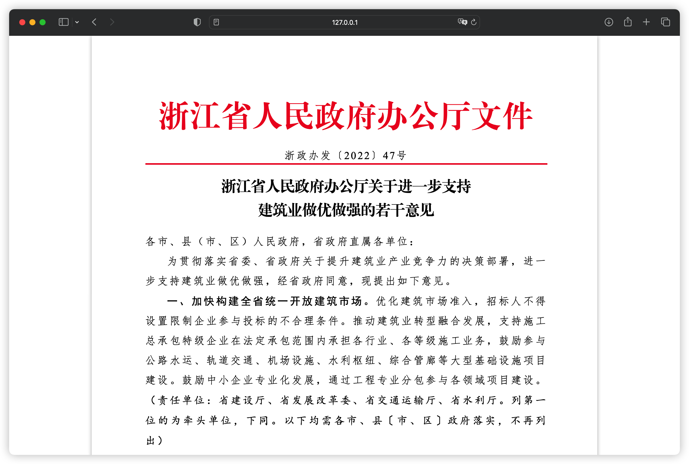

# 政府公文css主题

> 适用于typora导出markdown为html的主题
>
> 目前仅制作了导出html的css样式，typora应用内原生主题正在制作中！

### 在typora中导入引用css样式代码

请在`设置`>`导出`>`HTML(Without Styles)`中的`在<head/>中添加`输入如下代码：

```html
<link rel="stylesheet" href="https://cdn.jsdelivr.net/gh/kwhao/cn-gov-doc-style@main/css/cn-gov-doc.css">
```



### 在typora中导出html文件
点击`文件`>`导出`>`HTML(Without Styles)`即可


### markdown 说明

增加了一些标签，具体如下：

> 可以参考`sample.md`文件

- `<doch>红头文字</doch>`
- `<docsh>文件发行号</docsh>`
- `<apl>称呼，如：“各xxx单位：”</apl>`
- `<ih3>文字中不换行的3级黑体标题</ih3>`，可选 `ih1`~`ih6`
- `<note>楷体标注</note>`
- `<sign>发文者署名及时间</sign>`

样例：

